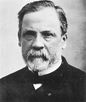

```{r setup, include=FALSE}
knitr::opts_chunk$set(echo = FALSE)
```


#### Words :504

## Vocabulary 

| word from the text | synonym in English     | french Translation                              |     |
| ------------------ | ---------------------- | ----------------------------------------------- | --- |
| Abiogenesis        | Spontaneous generation | abiogénèse                                      |     |
| maggots            | insects                | asticots                                        |     |
| clever             | smart                  | intelligent                                     |     |
| flask              | baloon                 | ballon (récipient pour expérience scientifique) |     |

## Analysis table 

| Researchers         | Louis Pasteur, Francesco Redi and others                                                                                                                                                                                                      |
| ------------------- | --------------------------------------------------------------------------------------------------------------------------------------------------------------------------------------------------------------------------------------------- |
| PUBLISHED IN        | all about science.org                                                                                                                                                                                                                         |
| GENERAL TOPIC       | the spontaneous generation/apparition of life                                                                                                                                                                                                 |
| PROCEDURE           | Scientists and especially Louis Pasteur made some experiences to proove that the life doesn't appear spontaneously. That's a step in the research in the origin of life. Louis Pasteur demonstrated that the air had no "reproductive power". |
| CONCLUSIONS         | Life can't appear with simple molecules and can't be create just in the air                                                                                                                                                                   |
| REMAINING QUESTIONS | How the life was created on our planet if it's not spontaneous                                                                                                                                       

<https://www.allaboutscience.org/origin-of-life.htm>

Distill is a publication format for scientific and technical writing, native to the web.

Learn more about using Distill at <https://rstudio.github.io/distill>.

